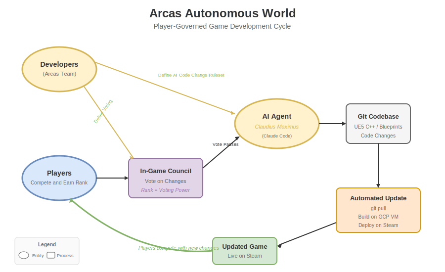
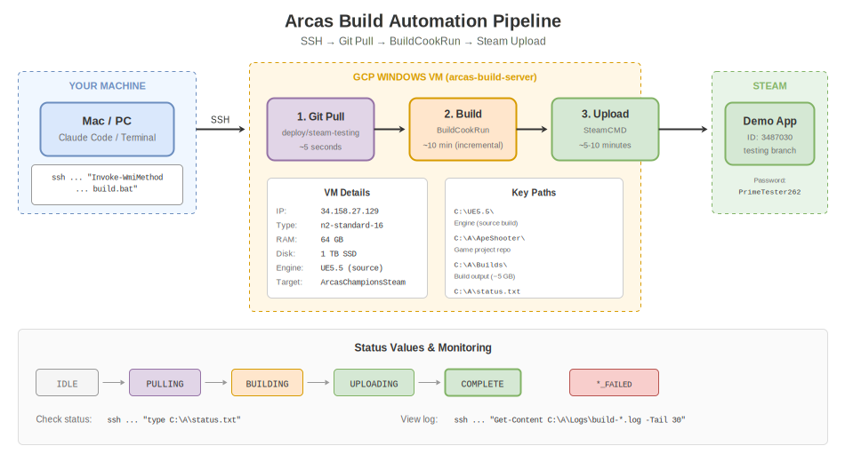

# Arcas Build Automation & Codebase Knowledge

Automated UE5 build pipeline, Steam deployment, and accumulated codebase knowledge for Arcas Champions development.

**Stack:** GCP Windows VM (GPU) + UE5.5 (source) + SteamCMD + SSH

```
┌─────────────┐      SSH       ┌─────────────────┐                ┌─────────────┐
│   Mac/PC    │ ──────────────▶│  GCP Windows VM │───────────────▶│ Steam Demo  │
│  (trigger)  │   1 command    │                 │    SteamCMD    │  (testing)  │
└─────────────┘                │  1. git pull    │                └─────────────┘
                               │  2. BuildCookRun│
                               │  3. Upload      │
                               └─────────────────┘
```

---

## Branch Strategy

```
feature/* ──▶ deploy/steam-testing ──▶ (automated build) ──▶ main (when stable)
```

| Branch | Purpose | Auto-build? |
|--------|---------|-------------|
| `main` | Stable code (don't touch) | NO |
| `deploy/steam-testing` | Active development | YES |
| `beta`, `early-access` | Legacy | NO |

**Workflow:**
1. Create feature branch from `deploy/steam-testing`
2. Work on feature, test locally
3. Merge to `deploy/steam-testing`
4. Trigger automated build → Steam testing branch

---

## Status: Fully Working ✅

**Last tested:** 2026-02-08
- Git pull from `deploy/steam-testing` ✅
- Full BuildCookRun ✅
- Steam upload to Demo testing branch ✅
- Incremental build time: ~10 minutes
- Full rebuild time: ~2-3 hours (rare)

---

## Quick Start

### Start a Build

```bash
ssh -i ~/.ssh/arcas_build_key daniel@34.65.146.42 \
  "powershell -Command \"Invoke-WmiMethod -Class Win32_Process -Name Create -ArgumentList 'cmd /c C:\\A\\Scripts\\build.bat'\""
```

### Check Status

```bash
ssh -i ~/.ssh/arcas_build_key daniel@34.65.146.42 "type C:\\A\\status.txt"
```

**Status values:** `IDLE` | `PULLING` | `BUILDING` | `UPLOADING` | `COMPLETE` | `PULL_FAILED` | `BUILD_FAILED` | `UPLOAD_FAILED`

### Monitor Progress

```bash
# View recent log output
ssh -i ~/.ssh/arcas_build_key daniel@34.65.146.42 \
  "powershell -Command \"Get-Content 'C:\\UE5.5\\Engine\\Programs\\AutomationTool\\Saved\\Logs\\Log.txt' -Tail 30\""

# Check if build is running
ssh -i ~/.ssh/arcas_build_key daniel@34.65.146.42 "tasklist | findstr /i dotnet"
```

---

## Arcas Configuration

### VM Details

| Property | Value |
|----------|-------|
| **VM Name** | arcas-build-server-gpu |
| **GCP Project** | arcas-champions |
| **Zone** | europe-west6-b |
| **External IP** | 34.65.146.42 |
| **Machine Type** | g2-standard-8 (8 vCPU, 32GB RAM, NVIDIA L4 24GB GPU) |
| **Disk** | 1TB SSD |
| **Capabilities** | Headless builds + UE5 Editor via RDP (GPU rendering) |
| **SSH User** | daniel |
| **SSH Key** | ~/.ssh/arcas_build_key |

### Directory Structure (on VM)

```
C:\
├── A\
│   ├── ApeShooter\                      # Git repo
│   │   └── NewApeShooter\               # UE5 project
│   │       └── NewApeShooter.uproject
│   ├── Builds\
│   │   └── ArcasChampionsSteam\Windows\ # Build output (4.87 GB)
│   ├── Scripts\
│   │   ├── build-and-deploy.ps1         # Main automation script
│   │   └── build.bat                    # Wrapper
│   ├── Logs\                            # Build logs
│   └── status.txt                       # Quick status file
│
├── UE5.5\                               # Engine (built from source)
│
└── SteamCMD\
    ├── steamcmd.exe
    └── app_build_3487030.vdf            # Demo app config
```

### Steam Apps

| App | ID | Depot | Automated? |
|-----|-----|-------|------------|
| **Arcas Champions Demo** | 3487030 | 3487031 | YES - `testing` branch |
| **Arcas Champions** | 3211990 | 3211991 | NO - manual only |

**Testing branch password:** `PrimeTester262`

### Build Target

- **Target:** `ArcasChampionsSteam`
- **Config:** Shipping
- **Platform:** Win64
- **Output:** `C:\A\Builds\ArcasChampionsSteam\Windows\`

---

## Build Pipeline

### What Happens

1. **Trigger** - SSH command starts `build.bat` as detached process
2. **Pull** - Fetches and pulls latest from `deploy/steam-testing` branch
3. **Build** - RunUAT.bat BuildCookRun (~10 min incremental, 2-3h full)
   - Compile (~30-45 min)
   - Cook assets (~60-90 min)
   - Stage, Pak, Archive (~15 min)
4. **Upload** - SteamCMD uploads to Demo `testing` branch (~5-10 min)
5. **Complete** - Status updated, build live on Steam (includes git commit hash)

### Build Times

| Type | Duration |
|------|----------|
| **Incremental** (typical) | ~10 minutes |
| Full rebuild | ~2-3 hours |
| Upload | 5-10 min |

---

## Files in This Repo

```
arcas-build-automation/
├── README.md                            # This file
├── vision-autonomous-world.drawio.svg   # Big picture - player governance vision
├── scripts/
│   ├── build-and-deploy.ps1             # Main PowerShell script (runs on VM)
│   └── build.bat                        # Batch wrapper
├── docs/
│   ├── setup-guide.md                   # Full setup guide (GCP, UE5, Steam)
│   └── build-pipeline.drawio.svg        # Current pipeline diagram
├── codebase/                            # Accumulated codebase knowledge
│   ├── general-workflow.md              # Dev cycle: SSH → C++ → Editor → Build → Steam
│   ├── totem-abilities.md               # Totem ability system architecture & Rage deep dive
│   └── totem-ui-active-effect.md        # Recipe: adding UI widgets to totem abilities
└── productization/                      # Cost models and Steam credentials research
```

## Diagrams

### Vision: Autonomous World


The full vision: Developers define rules → Players compete & vote in-game → AI generates code → Build deploys → Cycle repeats

### Current: Build Pipeline


What's working now: SSH trigger → Git pull → BuildCookRun → Steam upload

---

## Codebase Knowledge

The `codebase/` folder contains accumulated knowledge about the ApeShooter/Arcas Champions codebase. These docs are built up over time as we work on the game - they capture architecture, patterns, and step-by-step recipes for common tasks.

| Doc | What It Covers |
|-----|---------------|
| [general-workflow.md](codebase/general-workflow.md) | Full dev cycle: SSH access, SCP file strategy, compilation, build triggers, git workflow, key paths |
| [totem-abilities.md](codebase/totem-abilities.md) | Totem ability system class hierarchy, Rage ability deep dive, lifecycle, async loading, prediction |
| [totem-ui-active-effect.md](codebase/totem-ui-active-effect.md) | Recipe for connecting UI widgets to ability state (C++ + Blueprint patterns, positioning, troubleshooting) |

**Adding new knowledge:** When working on a new system (weapons, characters, networking, etc.), add a new `.md` to `codebase/` documenting what was learned - architecture, file locations, patterns, gotchas.

---

## Adapting for Other Games

This pipeline can be adapted for any UE5 game with Steam deployment. See [docs/setup-guide.md](docs/setup-guide.md) for the full setup process.

### Key Changes Needed

1. **VM Setup**
   - Create your own GCP project and VM
   - Generate your own SSH keys
   - Clone your UE5 project

2. **Script Configuration** (`build-and-deploy.ps1`)
   ```powershell
   # Modify these variables:
   $UE5Path = "C:\UE5.5"                              # Engine path
   $ProjectPath = "C:\A\YourProject\YourGame.uproject" # Your .uproject
   $TargetName = "YourTargetName"                      # Build target
   $BuildDir = "C:\A\Builds\YourTarget"               # Output path
   $SteamVDF = "C:\SteamCMD\app_build_XXXXX.vdf"      # Your VDF
   $SteamUser = "your_builder_account"                 # Steam account
   ```

3. **Steam VDF** (`app_build_XXXXX.vdf`)
   ```vdf
   "AppBuild"
   {
       "AppID" "YOUR_APP_ID"
       "Desc" "Automated build"
       "SetLive" "testing"
       "ContentRoot" "C:\A\Builds\YourTarget\Windows"
       "Depots"
       {
           "YOUR_DEPOT_ID"
           {
               "FileMapping"
               {
                   "LocalPath" "*"
                   "DepotPath" "."
                   "recursive" "1"
               }
           }
       }
   }
   ```

4. **SSH Commands**
   - Update IP address and username
   - Update SSH key path

### Requirements

- **UE5 from Source** - Required if using `CustomConfig` or custom build environments
- **GCP Account** - Or any Windows VM provider (AWS, Azure, etc.)
- **Steam Partner Access** - With builder account permissions
- **~1TB disk** - UE5 source + project + builds

### Estimated Setup Time

| Task | Duration |
|------|----------|
| GCP VM creation | 30 min |
| Build tools install | 1-2 hours |
| UE5 source clone + build | 4-6 hours |
| SteamCMD setup | 30 min |
| Script configuration | 30 min |
| **Total** | **~1 day** |

---

## Troubleshooting

### "Unique build environment" error
Your target uses `CustomConfig` or similar. You must use UE5 built from source, not Epic Games Launcher.

### SSH disconnects during build
The build runs detached via WMI - it continues even if SSH drops. Just reconnect and check status.

### Steam auth fails
Re-authenticate: `ssh ... "C:\SteamCMD\steamcmd.exe +login your_account +quit"`

### Out of disk space
UE5 source needs ~200GB, builds need ~10-50GB each. Use 750GB+ disk.

---

## Cost

| Resource | Cost |
|----------|------|
| VM (on-demand, g2-standard-8 + L4 GPU) | ~$1.00/hr |
| VM (spot, if available) | ~$0.30/hr |
| 1TB SSD | ~$170/month |
| **Per incremental build** | **~$0.13** (10 min) |
| **Per full rebuild** | **~$2.30** (3 hours) |

**Tip:** Stop VM when not building.

---

## Contact

**Arcas Games** - dan@arcas.games
